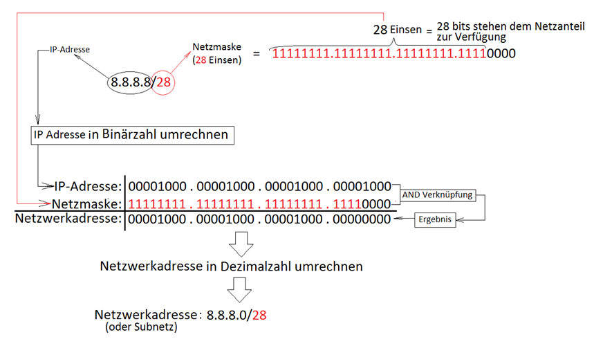

# Subnetting-Aufgabe: 172.18.0.0/24 in 3 Subnetze mit je 2 Hosts

## Aufgabenstellung
Teile das Netzwerk `172.18.0.0/24` in 3 Subnetze mit jeweils 2 nutzbaren Hosts pro Subnetz auf.

---

## Lösungsschritte

### 1. Anforderungen klären
- **Gegebenes Netzwerk:** `172.18.0.0/24`
- **Anzahl Subnetze:** 3
- **Hosts pro Subnetz:** 2 nutzbare IPs
- **Hostbits berechnen:**  
  `2^n - 2 ≥ 2` → `2^2 - 2 = 2` → **2 Hostbits benötigt**

> 💡 **Hinweis:** Die Formel `2^n - 2` subtrahiert immer 2 Adressen (Netzwerk + Broadcast), unabhängig von der Hostbit-Anzahl.  
> Ausnahme: `/31`-Subnetze (Point-to-Point) reservieren keine Adressen (RFC 3021).

### 2. Subnetzmaske berechnen
- **Neue Subnetzmaske:**  
  `32 - 2 Hostbits = 30` → **/30** (`255.255.255.252`)
- **Subnetzgröße:**  
  `2^2 = 4 Adressen (man kann aber nur 2 verwenden)

### 3. Subnetzeinteilung
| Subnetz | Netzwerkadresse | Nutzbare Hosts           | Broadcast   |
| ------- | --------------- | ------------------------ | ----------- |
| 1       | 172.18.0.0/30   | 172.18.0.1 – 172.18.0.2  | 172.18.0.3  |
| 2       | 172.18.0.4/30   | 172.18.0.5 – 172.18.0.6  | 172.18.0.7  |
| 3       | 172.18.0.8/30   | 172.18.0.9 – 172.18.0.10 | 172.18.0.11 |

### 4. Verifikation
- **Subnetz 1:**  
  - Netzwerk: `172.18.0.0`  
  - Hosts: `.1`, `.2`  
  - Broadcast: `.3`
  
- **Subnetz 2:**  
  - Netzwerk: `172.18.0.4`  
  - Hosts: `.5`, `.6`  
  - Broadcast: `.7`

- **Subnetz 3:**  
  - Netzwerk: `172.18.0.8`  
  - Hosts: `.9`, `.10`  
  - Broadcast: `.11`

