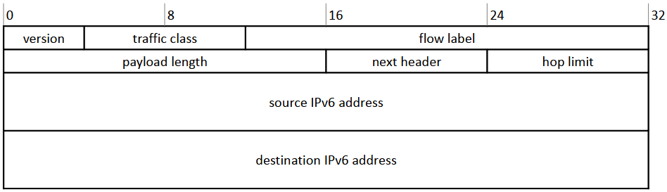

# Was ist IPv6?

IPv6 ist die neuste Version des Internetprotokolls und wurde entwickelt, um IPv4 zu ersetzen, da die Nachfrage nach neuen IP-Adressen stetig wächst.

# Warum IPv6?

- IPv4 hat etwa 4,3 Milliarden Adressen, welche schon fast alle aufgebraucht sind 

- Subnetting in IPv4 hat zu einer ineffizienten und schlechten Adressverteilung geführt, was Workarounds wie NAT erforderlich macht und Netzwerke komplexer gestaltet

- IPv6 hat IPsec standardmäßig integriert, was eine bessere Verschlüsselung und Authentifizierung gewährleistet

- Besitzt eine vereinfachte Header-Struktur für schnellere Verarbeitung

- Unterstützt sowohl zustandsbehaftete (DHCPv6) als auch zustandslose (SLAAC) Adresskonfiguration

- Nutzt hierarchische Adressierung, um Routingtabellen zu verkleinern.

# Aufbau IPv4 vs. IPv6


- Address Format: acht 4er Blöcke (2 Byte pro Block)

## Regeln zur Adressverkürzung:

- Führende Nullen in einem Block können weggelassen werden

- Aufeinanderfolgende Nullblöcke können durch ```::``` ersetzt werden (nur einmal pro Adresse)

- Beispiel: ```50b2:6400::6c3a:0:10a9```

## Aufbau


- Die letzten 8 Byte nennt man Interface-ID (kleinste mögliche Subnet /64 | größte mögliche Subnet /32)

# IPv6 Header



- Version (4bits): IP version, immer 6

- Traffic class (8 bits): Wird für QoS (Quality of Service*) genutzt.

- Flow label (20 bits): Wird für packet labelling genutzt, Ende-zu-Ende QoS

- Payload length (16 bits): Länge der Payload die dem Header folgt, in Byte, maximale Paket Größe von 64KB

- Next header (8 bits): Code für den folgenden extension header oder UL Protokoll

- Hop limit (8bits): Anzahl an hops bis das Paket verworfen wird

- Source address (128 bit)

- Destination address (128 bit)
  
  

*QoS: Mechanismus der bestimmten Netwerk Traffic priorisiert um bessere Performance zu bieten für z.B.: Video Streaming

# IPv6 Address Scopes

- Definiert die Gültigkeit und Reichweite einer Adresse innerhalb bestimmter Bereiche

- Scopes sind wichtig um festzulegen wo eine IPv6 Adresse gültig ist und wo sie verwendet werden kann

- Helfen dabei Routing zu optimieren und unnötigen Netzwerkverkehr zu vermeiden

## Wichtigsten Scopes

#### Interface-Local Scope

- Präfix: ```0x00```

- Adresse gilt nur innerhalb einer einzelnen Netzwerk-Schnittstelle auf einem Gerät -> Nur für die Kommunikation zwischen dem Netzwerk-Stack und der Schnittstelle gültig

- Wird für Kommunikation verwendet, die niemals das Gerät verlassen sollte wie z.B.: Neighbour Discovery

#### Link-Locale Scope

- Präfix: ```fe80::/10```

- Nur innerhalb eines einzelnen Links (eines lokalen Netzwerksegments oder Broadcast-Domain) gültig. Die Adressen werden automatisch an alle IPv6 fähigken Geräte in einem Link zugewesen

- Wird für Kommunikation zwischen Knoten innerhalb des gleichen Links verwendet wie z.B.: Routing-Protokolle

#### Global Scope

- Präfix: ```::/0```

- Ist weltweit gültig

- Wird für Kommunikation zwischen Geräten im Internet verwendet

#### Multicast-Skopes

Präfix: ```ff00::/8```

- Werden verwendet, um ein Paket an mehrere Empfänger zu senden

- Gibt spezifische Skopes, die den Bereich der Übertragung definieren:
  
  - Link-Local Multicast Scope: `ff02::/16` — Wird für Multicast-Kommunikation auf einem einzelnen Link verwendet
  
  - Site-Local Multicast Scope `ff05::/16` — Wird für die Kommunikation innerhalb eines Standorts oder einer Organisation verwendet
  
  - Global Multicast Scope: `ff0e::/16` — Wird für die Kommunikation über das Internet verwendet

# Stateless Address Auto Configuration (SLAAC)

### Link-Local Address

- Eine 48-Bit MAC-Adresse wird in eine 64-Bit interface ID transformiert indem das 7te Bit geflippt wird und ein ```ff``` und ```fe``` Byte nach den drittem Byte eingefügt wird.


#### Duplicate Address Detection (DAD)

- Schaut ob Adresse schon wer im Netz hat indem er einen Multicast aussendet mit seiner IPv6 Adresse als destination (Neighbour Discovery Protocol) → Wenn wer antwortet (Neighbor Advertisement), muss er sich eine neue suchen.

## Router Solicidation (RS) und Router Advertisement (RA)

- Fragt alle Router, welchen Standard sie für den Prefix verwenden

- Er verwendet die ff02::2 Adresse, die nur von den anderen Routern verarbeitet wird

- Nachdem ein Router diese Nachricht bekommen hat, schickt er den Prefix und die Länge der Adresse die sie verwenden zurück (RA) 

- Für das verwendet der Router eine spezielle multicast Adresse, alle anderen Netzwerkteilnehmer ignorieren die Nachricht.

- Wenn er Router mehrere Advertisments bekommt, nimmt er sie auf da ein Interface mehrere Adressen haben kann


## Globale Unicast Adresse

- Gateway wird zur Link-Local Adresse desselben Routers von dem er die Nachricht bekommen hat

- Damit der Client seine global unicast address bekommt, kombiniert er den Präfix mit seinem Identifier (link-locale address (ohne dem fe80:: davor))

## Duplicate Address Detection (DAD)

- Der Node macht das selbe nochmal für die generierte global unicast address

# DHCPv6

- Stateful DHCPv6: DHCPv6-Server verwaltet Adresszuweisungen und speichert, welcher Client welche IP-Adresse hat
  (Vergabe von Adressen und Konfigurationsdaten)

- Stateless DHCPv6: Client erhält seine IPv6-Adresse über SLAAC, aber holt sich weitere Informationen vom DHCPv6-Server
  Nur Konfigurationsdaten, keine Adressen

## Warum wird es benötigt?

### Zentrale Adressverwaltung

- SLAAC generiert Adressen clientseitig, dabei gibt es keine zentrale Übersicht
- Bei DHCPv6 kann ein Netzweradministrator genau nachvollziehen, welcher Client welche IP-Adresse erhalten hat.

### Zusätzliche Konfigurationsdaten

DHCPv6 erhält mehrere wichtige Parameter die bei SLAAC fehlen würden:

- DNS-Server
- Domainname
- NTP-Server
- SIP-Server
- Proxy-Informationen

Diese Informationen können nur über DHCPv6 übermittelt werden, entweder in Kombination mit SLAAC (stateless) oder vollständig über DHCPv6 (stateful)

Manche Betriebssysteme oder Geräte benötigen bestimmte Konfigurationsinformationen zwingend über DHCPv6. Ein reines SLAAC-Setup reicht in diesen Fällen nicht aus, weil z.B. kein DNS-Server bereitgestellt wird.

## Ablauf

1. **Client sendet eine SOLICIT-Nachricht (Typ 1)**  
   → Wird an die Multicast-Adresse `ff02::1:2` gesendet (alle DHCP-Relay-Agenten und Server)

2. **Server antworten mit ADVERTISE (Typ 2)**  
   → Mehrere Server können antworten und bieten ihre Dienste an

3. **Client wählt einen Server aus und sendet REQUEST (Typ 3)**  
   → Fordert die Zuweisung von IP-Adresse und weiteren Optionen an

4. **Server sendet REPLY (Typ 7)**  
   → Enthält IP-Adresse und Konfigurationsoptionen (z. B. DNS/NTP)
   
   

Für jede erhaltene Adresse muss DAD durchgeführt werden, um sicherzustellen, dass die Adresse im Netzwerk einzigartig ist.