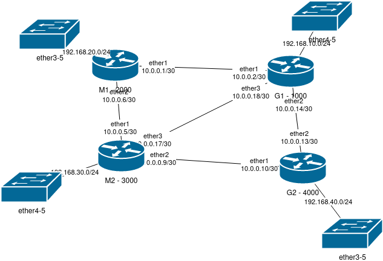

# Theorie
BGP ist das **wichtigste Routing-Protokoll für das Internet** und gehört zur **Klasse der Path-Vector-Protokolle**. Es unterscheidet sich stark von OSPF oder RIP, da es nicht für interne Netzwerke (IGPs), sondern für das **Routing zwischen autonomen Systemen (AS)** genutzt wird.

Ein **Autonomes System (AS)** ist ein unabhängig verwaltetes Netzwerk oder eine Gruppe von Netzwerken mit einer eigenen Routing-Politik, das über eine eindeutige AS-Nummer (ASN) identifiziert wird und mithilfe von BGP mit anderen AS kommuniziert, um den globalen Internetverkehr zu steuern.
## BGP-Typen: iBGP & BGP
| BGP-Typ             | Einsatzbereich                                 | Hop-Limit           | Best Path Selection                     |
| ------------------- | ---------------------------------------------- | ------------------- | --------------------------------------- |
| iBGP (Internal BGP) | Routing innerhalb eines autonomen Systems (AS) | Kein Hop-Limit      | Setzt bevorzugte externe eBGP-Routen um |
| eBGP (External BGP) | Routing zwischen autonomen Systemen (AS)       | Hop-Limit = 1 (TTL) | Sucht den besten Weg ins Internet       |
### eBGP (External BGP)
- Wird zwischen **verschiedenen AS** verwendet.
- Nutzt **AS-Path** als wichtigstes Attribut für die Routenwahl.
- Hat standardmäßig ein **TTL (Time-to-Live) von 1**, was bedeutet, dass die Nachbarn **direkt verbunden** sein müssen (kann mit `ebgp-multihop` erweitert werden).
### iBGP (Internal BGP)
- Wird **innerhalb desselben AS** verwendet.
- Funktioniert **nicht automatisch wie OSPF**, weil iBGP **kein Routing innerhalb des AS übernimmt**.
- iBGP-Router müssen **vollständig vermascht (Full-Mesh)** sein oder Route Reflectors (RR) nutzen.
## Router Reflector (RR)
**Problem bei iBGP:**  
iBGP benötigt eine **vollständige Vermaschung**, da iBGP-Router untereinander keine Routen weitergeben dürfen (kein Split-Horizon für iBGP).

**Lösung:**  
Route Reflectors (RR) reduzieren die Anzahl der iBGP-Verbindungen und erlauben eine **Hierarchie**.
- **RR empfängt iBGP-Routen** und kann sie an andere iBGP-Router weitergeben.
- Spart **Konfigurationsaufwand** und reduziert **Netzwerkkomplexität**.
```
    AS 65000
      |
+-------------------+
| Route Reflector  |
+-------------------+
    |       |
  R1       R2

```
- R1 und R2 müssen nicht direkt miteinander sprechen, sondern nur mit dem RR.

# Config


```
/system identity
set name=G1

/interface bridge
add name=br

/ip pool
add name=pool1 ranges=192.168.10.10-192.168.10.200

/ip dhcp-server
add address-pool=pool1 interface=br name=dhcp1

/interface bridge port
add bridge=br interface=ether4
add bridge=br interface=ether5

// BGP mit OSPF - ab hier

/ip address
add address=10.0.0.2/30 interface=ether1 network=10.0.0.0
add address=10.0.0.14/30 interface=ether2 network=10.0.0.12
add address=10.0.0.18/30 interface=ether3 network=10.0.0.16
add address=192.168.10.1/24 interface=br network=192.168.10.0

/ip dhcp-server network
add address=192.168.10.0/24 gateway=192.168.10.1

/routing bgp connection
add as=1000 local.address=10.0.0.2 .role=ebgp name=bgpConnM1 output.redistribute=\
    connected remote.address=10.0.0.1 router-id=10.0.0.2
add as=1000 local.address=10.0.0.18 .role=ebgp name=bgpConnM2 output.redistribute=\
    connected remote.address=10.0.0.17 router-id=10.0.0.2
add as=1000 local.address=10.0.0.14 .role=ebgp name=bgpConnG2 output.redistribute=\
    connected remote.address=10.0.0.13 router-id=10.0.0.2
```


