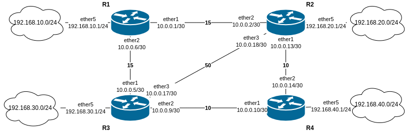

# Theorie
OSPF (Open Shortest Path First) ist ein dynamisches Routing-Protokoll, das das **Link-State-Routing-Verfahren** verwendet.
## Grundprinzip
- Es nutzt den **Dijkstra-Algorithmus** (Shortest Path First, SPF), um die kürzesten Pfade zu berechnen.
- Es nutzt **Multicast (224.0.0.5 und 224.0.0.6)** für die Kommunikation zwischen Routern.
## Netzwerkaufbau
- OSPF organisiert Netzwerke in **Areas**, um die Routing-Tabelle zu optimieren.
- **Area 0 (Backbone-Area)** ist die Hauptarea, zu der alle anderen Areas verbunden sein müssen.

- Routing Tabelle enthält Regeln darüber, wie Datenpakete von einem Netzwerk zum anderen weitergeleitet werden. Jeder Router oder Computer mit mehreren Netzwerkschnittstellen nutzt eine Routing-Tabelle, um zu entscheiden, wohin ein Paket gesendet werden soll. Areas sind dafür da um die Routing Tabelle kleiner und Router-ressourcensparender zu halten.
#### Link-State Database (LSDB)
- Die **LSDB** ist eine **Datenbank**, in der jeder OSPF-Router den gesamten Netzwerkzustand speichert.
- Enthält alle **Link-State Advertisements (LSAs)** der Area.
- **Jeder Router hat eine identische LSDB innerhalb einer Area** (dank Synchronisation).
- Wird zur Berechnung der kürzesten Pfade (mit dem **Dijkstra-Algorithmus**) genutzt.
#### Link-State Advertisement (LSA)
- Ein **LSA** ist eine _Nachricht_, die Netzwerkinformationen (z. B. Router, Links, Subnetze) beschreibt.
- Es gibt **verschiedene LSA-Typen** (z. B. Typ 1 für Router, Typ 2 für Netzwerke, Typ 5 für externe Routen).
- Werden zwischen Routern ausgetauscht, um die LSDB aktuell zu halten.
## Pakettypen - Ablauf
1. **Hello-Paket**
    - **Zweck:** Nachbarschaftsbildung (_Neighbor Discovery_).
    - Enthält Infos wie Router-ID, Hello-Intervalle und Area-ID.
    - Wird regelmäßig an **Multicast-Adresse `224.0.0.5`** gesendet.
    - **Antwort:** Wenn Parameter übereinstimmen, wird eine OSPF-Nachbarschaft (_Adjacency_) aufgebaut.
        
2. **Database Description (DBD)**
    - **Zweck:** Austausch einer **Zusammenfassung der LSDB** (Liste aller LSAs).
    - Wird während der **initialen Synchronisation** gesendet.
    - Hilft festzustellen, welche LSAs fehlen oder veraltet sind.
        
3. **Link-State Request (LSR)**
    - **Zweck:** Fordert **fehlende oder aktuellere LSAs** an.
    - Ein Router vergleicht die DBD mit seiner eigenen LSDB und fordert fehlende Infos an.
        
4. **Link-State Update (LSU)**
    - **Zweck:** Überträgt die **vollständigen LSA-Informationen**.
    - Enthält ein oder mehrere LSAs, um die LSDB zu aktualisieren.
    - Wird auch bei Änderungen im Netzwerk (z. B. Link-Down) gesendet.
        
5. **Link-State Acknowledgment (LSAck)**
    - **Zweck:** Bestätigt den **Erhalt von LSUs**.
    - Stellt sicher, dass LSAs zuverlässig übertragen werden.

**Beispiel:**
- Router A sendet ein **Hello**, Router B antwortet.
- Router A sendet **DBD**, Router B erkennt fehlende LSAs.
- Router B fordert sie per **LSR** an.
- Router A sendet die LSAs per **LSU**.
- Router B bestätigt mit **LSAck**.
- Nun haben beide die gleiche LSDB.
## OSPF-Typen (**Link-State Advertisement**-Typen)
OSPF verwendet verschiedene LSA-Typen, um Routing-Informationen im Netzwerk auszutauschen. Diese Typen definieren, welche Informationen verteilt werden und wie die Netzwerkstruktur aussieht.

1. **LSA Typ 1 (Router-LSA)**
    
    - Beschreibt die Links und Interfaces eines Routers innerhalb einer **Area**.
    - Wird von jedem OSPF-Router erzeugt und nur innerhalb der eigenen Area verbreitet.
        
2. **LSA Typ 2 (Network-LSA)**
    
    - Wird vom **Designated Router (DR)** in einem Broadcast-/Multi-Access-Netzwerk (z. B. Ethernet) erzeugt.
    - Listet alle Router im selben Netzwerksegment auf.
        
3. **LSA Typ 3 (Summary-LSA)**
    
    - Wird von **Area Border Routern (ABR)** erzeugt, um Routen aus einer Area in andere Areas zu propagieren (Inter-Area-Routing).
    - Fasst Netzwerke zusammen, um die Routing-Tabelle zu optimieren.
        
4. **LSA Typ 4 (ASBR-Summary-LSA)**
    
    - Wird von einem **ABR** erzeugt, um den Standort eines **Autonomous System Boundary Router (ASBR)** bekannt zu machen.
    - Hilft bei der Weiterleitung zu externen Routen (z. B. aus BGP oder statischen Routen).
        
5. **LSA Typ 5 (AS-External-LSA)**
    
    - Wird von einem **ASBR** erzeugt, um **externe Routen** (z. B. aus BGP oder statischen Routen) in die OSPF-Domain einzubringen.
    - Wird im gesamten OSPF-AS verbreitet.
        
6. **LSA Typ 7 (NSSA-LSA, nur in NSSA Areas)**
    
    - Ähnlich wie Typ 5, aber für **Not-So-Stubby Areas (NSSA)**, die keine externen Routen empfangen dürfen.
    - Wird von einem ASBR in einer NSSA erzeugt und von einem ABR in Typ 5 umgewandelt.

- **LSA 1 & 2** → Intra-Area-Routing (innerhalb einer Area)
- **LSA 3 & 4** → Inter-Area-Routing (zwischen Areas)
- **LSA 5 & 7** → Externe Routen (z. B. aus BGP)

# Config

### Router 1:
```
/system
identity set name=Router1

/ip address
add address=10.0.0.1/30 interface=ether1 network=10.0.0.0
add address=10.0.0.6/30 interface=ether2 network=10.0.0.4
add address=192.168.10.1/24 interface=ether5 network=192.168.10.0

/routing ospf instance
add disabled=no name=OSPFInst1 redistribute=connected router-id=10.0.0.1

/routing ospf area
add disabled=no instance=OSPFInst1 name=backbone

/routing ospf interface-template
add area=backbone cost=15 disabled=no interfaces=ether1
add area=backbone cost=15 disabled=no interfaces=ether2
```

Hier sind alle Router in der Backbone-Area (Area-0) da sie alle wichtig sind (eine Verbindung zu einem PC/Internet haben).
