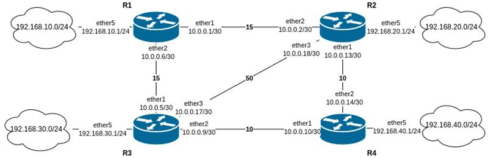

# Theorie
OSPF ([Wikipedia](https://de.wikipedia.org/wiki/Open_Shortest_Path_First)/[MikroTik Docs](https://help.mikrotik.com/docs/spaces/ROS/pages/9863229/OSPF#OSPF-Overview)) ist ein dynamisches Routing-Protokoll, das verwendet wird, um die Routing-Informationen zu entdecken und aufrechtzuerhalten, die erforderlich sind, um Datenpakete effizient über das Netzwerk zu leiten. Es ist eines der weitesten verbreiteten Interior Gateway Protokolle (IGPs) in großen Unternehmensnetzwerken.
## Wichtiges zu OSPF
- Link-State-Protokoll: OSPF ist ein Link-State-Routing-Protokoll, was bedeutet, dass Router Informationen über die Erreichbarkeit ihrer Nachbarn austauschen. Jeder Router erstellt eine Karte der Topologie des Netzwerks, die als Link-State-Datenbank (LSDB) bezeichnet wird und verwendet wird, um den kürzesten Weg zu jedem Ziel zu berechnen.

- Hierarchisches Design: OSPF-Netzwerke können in Bereiche (Areas) organisiert werden, die logische Gruppierungen von Routern und Netzwerken darstellen. Diese hierarchische Design hilft dabei, die Größe des LSDB und die Menge an Routing Informationen, die ausgetauscht werden müssen, zu reduzieren.

- Kostenbasierte Metrik: OSPF verwendet eine kostenbasierte Metrik, um den besten Pfad zu einem Ziel zu bestimmen. Die Kosten einer Route werden auf Basis der Bandbreite der Verbindung berechnet. Pfade mit niedrigen Kosten werden gegenüber Pfaden mit höheren Kosten bevorzugt.

- Schnelle Konvergenz: OSPF unterstützt eine schnelle Konvergenz, wodurch Router schnell auf Änderungen des Netzwerks reagieren können. Wenn eine Verbindung oder ein Router ausfällt, können OSPF-Router innerhalb von Sekunden Routen neu berechnen und ihre Routing-Tabellen aktualisieren.
## OSPF-Komponenten
- Router: Ein Router auf dem die Routing-Informationen mittels OSPF-Paketen ausgetauscht werden.

- Hello-Protokoll: OSPF-Router verwenden das Hello-Protokoll, um Nachbarn zu entdecken und Verbindungen mit benachbarten Routern herzustellen. Diese Pakete werden in periodischen Abständen geschickt.

- Dijkstra-Algorithmus: Unter Verwendung des Dijkstra-Algorithmus wird der kürzeste Pfad zwischen allen Routern berechnet. Das führt zu einer Routing-Tabelle, die den besten Weg zu jedem Netzwerk enthält.

- Master Router: Es wird ein Master/Main Router durch die höchste gesetzte Priorität gewählt (falls keine Prioritäten gesetzt sind wird die Router-ID verwendet), über diesen werden die Datenbanken (LSDB) syncronisiert
## Areas
- OSPF organisiert Netzwerke in **Areas**, um die Routing-Tabelle zu optimieren.
- - Routing Tabelle enthält Regeln darüber, wie Datenpakete von einem Netzwerk zum anderen weitergeleitet werden. Jeder Router oder Computer mit mehreren Netzwerkschnittstellen nutzt eine Routing-Tabelle, um zu entscheiden, wohin ein Paket gesendet werden soll. Areas sind dafür da um die Routing Tabelle kleiner und Router-ressourcensparender zu halten.

- **Backbone**
  - Areas müssen mit Backbone gekoppelt sein
  - Oberste Area (ID 0 )
  - Verbindungsbrücke
- **Regular Area**
  - Alle anderen Areas
  - ID von 1 bis 2 32 − 1
- **Transit**  
  - Überbrückungsarea
  - ist nicht an Backbone verbunden
  - Verkehr wird zwischen mit Transit verbunden Areas direkt vermittelt (geht nicht über Backbone)
## Merkmale 
- OSPF garantiert ein schleifenfreies Routing im Gegensatz zu RIP
- Es nutzt das Hello-Protokoll für die Überwachung der Nachbarn
- Es unterstützt VLSM, sowie CIDR
- OSPF ist für große, skalierbare Netze gut geeignet
- Das Area-Konzept vereinfacht die Kommunikation und Wartung
## Pakettypen
- Hello packet --> Neighbour Discovery und gegenüberstehende Verbindungen aufbauen

- Database Description (DD) --> Datenbank syncronisation zwischen Routern, wird nach Verbindungsaufbau gesendet

- Link-State Request (LSR) --> Neue Datenbankteile werden abgefragt, veraltete Einträge werden nach DD ermittel

- Link-State Update (LSU) --> Trägt neue gefragte Link-State Einträge

- Link-State Acknowledgment (LSack) --> Bestätigt angekommene Pakete, so kommt es zu stabilen Datenaustausch

**Beispiel:**
- Router A sendet ein **Hello**, Router B antwortet.
- Router A sendet **DBD**, Router B erkennt fehlende LSAs.
- Router B fordert sie per **LSR** an.
- Router A sendet die LSAs per **LSU**.
- Router B bestätigt mit **LSAck**.
- Nun haben beide die gleiche LSDB.

# Config


### Router 1
```
/system identity
set name=R1

/routing ospf instance
add disabled=no name=OSPFInst1 redistribute=connected router-id=10.0.0.1

/routing ospf area
add disabled=no instance=OSPFInst1 name=backbone

/ip address
add address=10.0.0.1/30 interface=ether1 network=10.0.0.0
add address=10.0.0.6/30 interface=ether2 network=10.0.0.4
add address=192.168.10.1/24 interface=ether5 network=192.168.10.0

/routing ospf interface-template
add area=backbone cost=15 disabled=no interfaces=ether1
add area=backbone cost=15 disabled=no interfaces=ether2
```
