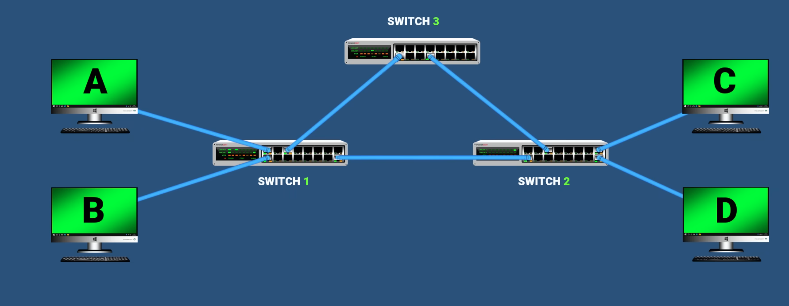
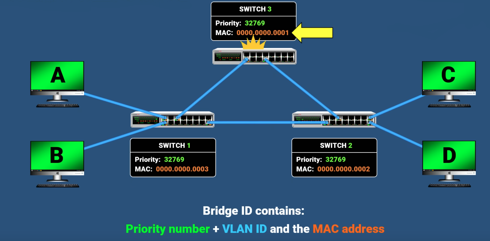
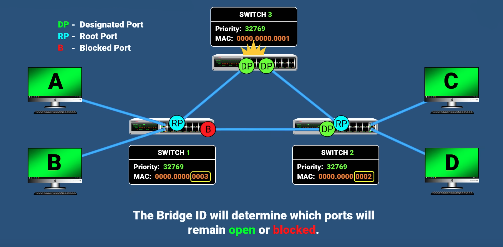

## Was ist das Spanning Tree Protocol (STP)?
Das Spanning Tree Protocol (STP) ist ein Netzwerkprotokoll, das in Ethernet-Switches verwendet wird, um Schleifen (Loops) in einem redundanten Netzwerkdesign zu verhindern. Es wurde von IEEE als 802.1D standardisiert.
## Wie funktioniert STP?
STP arbeitet, indem es einen logischen Baum (Spanning Tree) in einem Netzwerk erstellt und redundante Verbindungen temporär deaktiviert, sodass keine Endlosschleifen entstehen. Falls ein aktiver Link ausfällt, kann STP eine zuvor deaktivierte Verbindung aktivieren und somit die Netzwerkverfügbarkeit verbessern.
## Arten von STP
- **Original STP (802.1D):** Die Basisversion des Spanning Tree Protocols.
- **PVST+:** Eine Cisco-Verbesserung, die pro VLAN Spanning Trees hinzufügt. Standard bei Cisco.
- **RSTP (802.1w):** Verbesserte Version des STP mit deutlich schnellerer Konvergenz.
- **Rapid PVST+:** Eine Cisco-Verbesserung von RSTP, die pro VLAN Funktionalität bietet und große Netzwerke effizienter macht.

**STP Loop (Schleifenbildung)**
- Wenn STP nicht richtig konfiguriert ist oder fehlschlägt, kann es zu Schleifen (Loops) im Netzwerk kommen.
- Diese Schleifen entstehen, wenn Datenpakete unkontrolliert in einem Kreis zwischen Switches weitergeleitet werden.
- Dies führt dazu, dass dasselbe Paket immer wieder übertragen wird, was das Netzwerk überlastet und zu Latenzproblemen oder sogar vollständigen Ausfällen führt.

**Broadcast Storm (BC-Storm, Broadcast-Sturm)**
- Ein Broadcast Storm tritt auf, wenn zu viele Broadcast-Pakete im Netzwerk zirkulieren.
- Dies passiert oft durch Schleifenbildung, wenn Broadcasts (z. B. ARP-Anfragen) endlos weitergeleitet werden.
- Ein Broadcast-Sturm kann dazu führen, dass Netzwerkgeräte überlastet werden und das gesamte Netzwerk nicht mehr reagiert.
- Lösung: STP sorgt dafür, dass Schleifen vermieden werden, indem es einige Verbindungen blockiert.

**Wie verhindert STP Loops und Broadcast-Stürme?**
- Root Bridge Wahl: STP wählt einen zentralen Switch als Root Bridge, von dem aus der Baum aufgebaut wird.
- Path Cost Berechnung: Die besten Pfade werden anhand von Kostenwerten (Path Cost) bestimmt.
- Blockierung redundanter Links: STP deaktiviert Links, die eine Schleife verursachen könnten.
- Rekonvergenz: Wenn eine aktive Verbindung ausfällt, reaktiviert STP automatisch eine blockierte Verbindung.
## Wahl der Root-Bridge
- Jeder Switch schlägt sich selbst als Root-Bridge vor und sendet BPDUs.
- Die Wahl fällt auf den Switch mit der niedrigsten Bridge-ID als Root-Bridge.
	- Zuerst wird die **Bridge Priority** verglichen. Ist diese gleich (z. B. bei Standardeinstellungen), entscheidet die **MAC-Adresse**:
    - **Die niedrigere MAC-Adresse gewinnt.**
### Beispiel:
- **Switch A**: Priority = 32768, MAC = 00:11:22:33:44:55
- **Switch B**: Priority = 32768, MAC = 00:11:22:33:44:66

- **Ergebnis**: Switch A wird Root-Bridge, weil seine MAC-Adresse niedriger ist.
## Wahl des blockierten Ports
1. **Root-Bridge wählen:** Der Switch mit der niedrigsten Bridge-ID wird als "König der Switches" gewählt.
2. **Forwarding-Zustand für Root-Bridge-Schnittstellen einstellen.**
3. **Root-Port auf jedem Nicht-Root-Switch auswählen:** Dies ist die beste Route zur Root-Bridge.
4. **Designated Ports für die verbleibenden Links wählen.**
5. **Alle anderen Ports in den Blocking-Zustand versetzen.**
## Rollen
- **Root-Ports:** Der Root Port ist der **beste Pfad** eines Nicht-Root-Switches zur Root-Bridge.
- **Designated Ports:** Der Port mit der besten Route zur Root-Bridge auf einem Link.
- **Non-Designated Ports:** Alle anderen Ports, die sich im Blocking-Zustand befinden.
## Zustände
- **Disabled:** Ein deaktivierter Port.
- **Blocking:** Ein Port, der den Verkehr blockiert und vor dem Weiterleiten in den Listening-Zustand wechseln muss.
- **Listening:** Leitet keinen Verkehr weiter und lernt keine MAC-Adressen. Ein Übergangszustand.
- **Learning:** Leitet keinen Verkehr weiter, lernt aber MAC-Adressen. Ein Übergangszustand.
- **Forwarding:** Sendet und empfängt normalen Verkehr.
## Algorithmus
STP ähnelt dem Kruskal Algorithmus ist aber nicht genau der, da wir nicht immer einen minimalen Stammbaum wollen.

**Warum?**
- Nicht gleichmäßige Lastverteilung (Load Balancing)
- Vermeidung von Single Points of Failure
- Der Kruskalalgorithmus berücksichtigt nicht die Geschwindigkeiten der Leitung

## **Nachteile von STP**
- **Konvergenzzeit**: STP benötigt 30 bis 50 Sekunden für die Konvergenz, um das Netzwerk nach Änderungen zu stabilisieren. Dies kann in großen Netzwerken spürbare Verzögerungen verursachen.

---

# **Unterschiede zwischen STP und RSTP**

**Rapid Spanning Tree Protocol (RSTP, IEEE 802.1w)** ist eine Weiterentwicklung von STP und bietet wesentliche Verbesserungen.

## **Schnellere Konvergenz**
- **RSTP** erreicht eine deutlich schnellere Konvergenz (in der Regel innerhalb von Sekunden), während **STP** 30-50 Sekunden benötigt. Dies wird durch den neuen Zustand "Discarding" erreicht, der den Übergang zu "Forwarding" beschleunigt, indem die Zustände "Blocking", "Listening" und "Learning" zusammengefasst werden.

## **BPDU-Handling**
- **RSTP** sendet BPDUs alle 2 Sekunden, unabhängig von eingehenden BPDUs, um Änderungen schneller zu erkennen.
- **STP** sendet BPDUs nur basierend auf den BPDUs der Root-Bridge und wartet darauf, dass andere Switches BPDUs senden.

## **Kompatibilität**
- **RSTP** ist vollständig rückwärtskompatibel zu STP. Es arbeitet mit STP-Switches zusammen, indem es sich auf den älteren STP-Modus zurücksetzt, wenn es mit einem STP-Switch verbunden ist.

## **Edge Ports**
- **RSTP** erkennt automatisch Edge Ports (Ports, die mit Endgeräten verbunden sind) und versetzt diese sofort in den Forwarding-Zustand, ohne auf die normalen Verzögerungsprozesse von STP warten zu müssen.

---

# **Beispiel**

Ein Netzwerk mit 3 Switches soll konfiguriert werden. Bestimme die Root-Bridge und konfiguriere die Ports der Switches entsprechend.

**Schritte:**

1. **Bridge-ID bestimmen**: Die Bridge-ID setzt sich aus der Priorität und der MAC-Adresse zusammen. Die Priorität ist standardmäßig 32768, die MAC-Adresse ist die Basis-MAC-Adresse des Switches.
   - Switch 1: Bridge-ID = 32768 + MAC-Adresse
   - Switch 2: Bridge-ID = 32768 + MAC-Adresse
   - Switch 3: Bridge-ID = 32768 + MAC-Adresse

**Root-Bridge bestimmen**: Die Root Bridge ist der Switch mit der niedrigsten Bridge-ID.
Die Bridge-ID des Switch 1 ist die niedrigste, daher ist Switch 1 die Root-Bridge.

2. **Ports konfigurieren**:
   - **Switch 1**:
     - Port 1: Root-Port (Forwarding)
     - Port 2: Blocked Port (Blocking)
   - **Switch 2**:
     - Port 1: Root-Port (Forwarding)
     - Port 2: Designated Port (Forwarding)
   - **Switch 3**:
     - Port 1: Designated Port (Forwarding)
     - Port 2: Designated Port (Forwarding)

