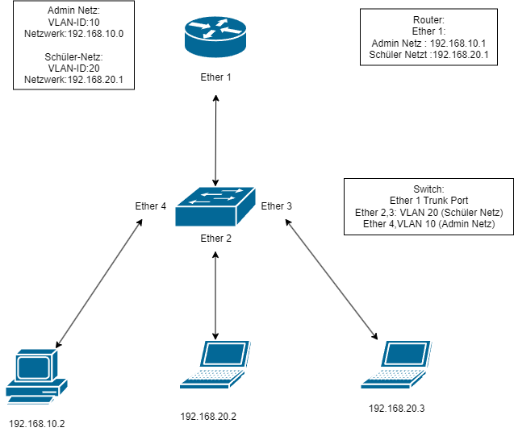

# Theorie
**VLAN (Virtual Local Area Network)** trennt Netzwerke logisch, ohne physische Hardware zu ändern. Dadurch können Geräte in verschiedenen VLANs isoliert werden, obwohl sie am gleichen Switch angeschlossen sind.

Vorteile:
- Erhöhte Sicherheit
- Bessere Netzwerkstruktur
- **Reduzierter Broadcast-Traffic**
  - Entlastet das Netzwerk und verbessert die Leistung
## VLAN Header
Ein VLAN-Tag wird in ein Ethernet-Frame eingefügt, um Pakete einem bestimmten VLAN zuzuordnen.


### Aufbau
- Tag Protocol Identifier (TPID)
    - 2 Byte größe
    - zeigt an, dass ein VLAN-Tag vorhanden ist

- Priority Code Point (PCP)
    - 3 bit
    - Werte von 0 bis 7
    - Dient zur **Priorisierung von Datenverkehr** (Quality of Service, QoS)
    - Höhere Werte bedeuten höhere Priorität

- Drop Eligible Idicator (DEI)
    - 1 bit
    - Unterstützt das Netzwerk bei Entscheidungen, welche Frames bei Engpässen zuerst verworfen werden sollen
    - Hilfreich in überlasteten Netzwerken zur Laststeuerung

- VLAN ID (VID)
    - 12 bits
    - Wertebereich: **1 bis 4094**
        - 0 => Keine VLAN-Zugehörigkeit


- Ein VLAN hat eine 2 byte ID
- VLAN ids werden im Ethernet Header mitgeschickt, man nennt das tagged bzw. untagged
- Im Feld 802.1Q tag

## Egress-/Ingress-Liste
- VLANs können also von Switches gehandelt werden.
- Jedes VLAN auf einem Switch hat eine Egress- und Ingress-Liste
- Egress-Liste bestimmt, auf welchem Interface die Ethernet Frames mit diesem VLAN getagged werden. 
- untagged heißt, dass die Frames keine VLAN Information enthalten, wird meistens verwendet, wenn nur Endgeräte an dem Interface hängen. Also dann die "untagged" Liste
- Ingress-Liste bestimmt für jedes Interface, wenn ein Frame ohne VLAN Infos kommt, in welches VLAN es kommt.
- Man kann sich vorstellen jedes Interface hat eine optionale Port VLAN ID (pvid).
## Funktionsweise
Die Funktionsweise von VLANs beruht auf der Zuweisung von Ports auf Netzwerkswitches zu bestimmten VLAN-IDs. Wenn ein Paket durch einen Switch weitergeleitet wird, prüft der Switch die VLAN-ID des Pakets und leitet es entsprechend an die Ports weiter, die diesem VLAN zugewiesen sind.

Dadurch können Geräte innerhalb desselben VLANs miteinander kommunizieren, während der Datenverkehr zwischen VLANs durch Router geleitet werden muss.
## Wieso die Bridge tagged gehört
Die Bridge muss getaggt sein, weil sie den Datenverkehr zwischen den VLANs und dem Router verwaltet. Wenn sie nicht getaggt ist, würden die VLAN-Interfaces auf dem Router die Daten nicht richtig erkennen.

Durch das Tagging weiß der Router, welches VLAN welches ist, und kann den Traffic richtig leiten.

Ohne Tagging kann es passieren, dass VLAN-Pakete nicht korrekt verarbeitet werden oder in das falsche VLAN geleitet werden.

# Config


In diesem Beispiel werden wir zwei Netze anlegen:

| Schüler Netz              | Admin Netz                |
| ------------------------- | ------------------------- |
| VLAN-ID 20                | VLAN-ID 10                |
| Netzwerk  192.168.20.0/24 | Netzwerk  192.168.10.0/24 |
## Konfiguration
**Router**
```
# VLAN Bridge erstellen
/interface bridge
add name=br vlan-filtering=yes

# Bridge-Ports definieren
/interface bridge port
add bridge=br interface=ether1

# VLANs auf der Bridge taggen
/interface bridge vlan
add bridge=br tagged=ether1 vlan-ids=10,20

# VLAN-Interfaces auf dem Router
/interface vlan
add interface=br name=vlan10 vlan-id=10
add interface=br name=vlan20 vlan-id=20

# IP-Adressen für VLANs
/ip address
add address=192.168.10.1/24 interface=vlan10
add address=192.168.20.1/24 interface=vlan20
```

**Switch**
```
# VLAN Bridge erstellen
/interface bridge
add name=bridge_vlan protocol-mode=none vlan-filtering=yes

# Bridge-Ports definieren
/interface bridge port
add bridge=bridge_vlan interface=ether1
add bridge=bridge_vlan interface=ether2
add bridge=bridge_vlan interface=ether3
add bridge=bridge_vlan interface=ether4

# VLANs auf der Bridge taggen
/interface bridge vlan
add bridge=bridge_vlan tagged=ether1 untagged=ether2,ether3 vlan-ids=20
add bridge=bridge_vlan tagged=ether1 untagged=ether4 vlan-ids=10
```
