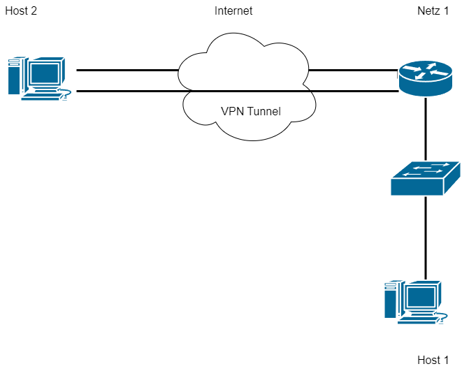
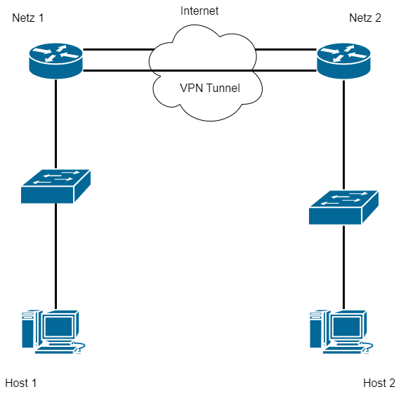

# Theorie
## Was ist ein VPN?
- Ein VPN, oder Virtual Private Network, ist eine Technologie, die eine sichere Verbindung über das Internet ermöglicht, indem sie Daten verschlüsselt durchs Internet tunnelt
## Anwendungsbereiche
1. **Remote Access**: Mitarbeiter können von zu Hause oder unterwegs auf Unternehmensnetzwerke zugreifen.
2. **Site-to-Site**: Verbindet zwei oder mehrere Netzwerke durch das Internet miteinander
3. **Geoblocking**: Umgeht geografische Sperren, z.B. Zensur bestimmter Länder oder um auf Netflix USA zuzugreifen.
4. **Privatsphäre**: Maskiert die eigene IP-Adresse und schützt Daten vor unerwünschten Zugriffen.
## Arten von VPNs
### Roadwarrior VPN
Einzelne Hosts verbinden sich in ein Netzwerk

### Site-to-Site VPN
Verbindet zwei oder mehrere Netzwerke durch das Internet miteinander

### L2TP/IPSec
#### Übersicht
L2TP over IPsec ist eine Kombination aus dem Sicherheitsprotokoll IPsec und dem Tunneling-Protokoll L2TP (definiert in [RFC 3193](https://datatracker.ietf.org/doc/html/rfc3193)). Dabei wird L2TP durch IPsec getunnelt. Durch diese Kombination heben sich die Schwächen beider Protokolle gegenseitig auf und es entsteht ein flexibles Tunneling-Protokoll mit höchster Sicherheit.
#### L2TP
L2TP, Layer 2 Tunneling Protocol (ISO/OSI Model Layer 2) ist ein Tunneling-Protokoll, das über UDP tunnelt. Aktuell verwendet man Version 3 (L2TPv3 definiert in [RFC 3931](https://datatracker.ietf.org/doc/html/rfc3931)). L2TP enthält selbst keine Verschlüsselung. Dies wird meist von einem andern Protokoll wie IPsec übernommen.
#### IPsec
IPsec, Internet Protocol Security (ISO/OSI Model Layer 3) ist ein Protokoll für sichere Kommunikation über unsichere IP-Netze (definiert in [RFC 2401](https://datatracker.ietf.org/doc/html/rfc2401#section-1) und ergänzt durch [RFC 4301](https://datatracker.ietf.org/doc/html/rfc4301)). Es wird durch Verschlüsselung die Vertraulichkeit sowie die Authentizität und Integrität der Paketreihenfolge gewährleistet.  
Zum Schlüsselaustausch wird meist IKEv2 (Internet Key Exchange Version 2) verwendet.  
Es gibt zwei Modi in denen IPsec betrieben werden kann, transport-mode und tunnel-mode. Im transport-mode werden zwei Endpunkte Point-to-Point verbunden, dementsprechend müssen nur die Nutzdaten verschlüsselt werden. Im tunnel-mode werden zwei Netzwerke miteinander verbunden daher muss das gesamte Paket verschlüsselt werden und es wird ein neuer IP-Header hinzugefügt.  
Außerdem gibt es zwei Arten wie IPsec angewendet wird, AH (Authentication Header) und ESP (Encapsulating Security Payload). AH sorgt nur für Authentizität und Integrität (Nutzdaten im Clear-Text), ESP hingegen auch für Verschlüsselung (Nutzdaten nicht im Clear-Text).

# Config


**VPN-Server**
```
/interface l2tp-server server
set enabled=yes ipsec-secret=mySecret use-ipsec=required
/ppp secret
add local-address=10.0.0.2 name=user1 password=Gantner123 remote-address=10.0.0.1 service=l2tp
/ip route
add dst-address=192.168.20.0/24 gateway=10.0.0.1
```

**VPN-Client**
```
/interface l2tp-client
add connect-to=193.82.200.13 disabled=no name=l2tp-client use-ipsec=required user=user1 password=Gantner123
/ip route
add dst-address=192.168.10.0/24 gateway=l2tp-client
```

