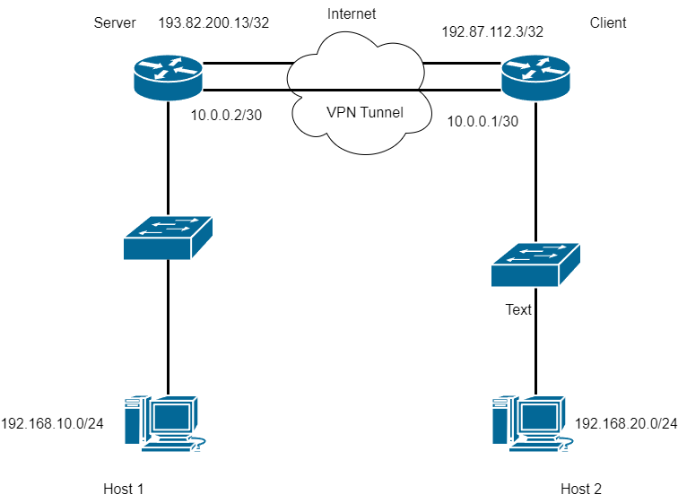

# Theorie
## Was ist ein VPN?
- Ein VPN, oder Virtual Private Network, ist eine Technologie, die eine sichere Verbindung über das Internet ermöglicht, indem sie Daten verschlüsselt durchs Internet tunnelt
## Anwendungsbereiche
1. **Remote Access**: Mitarbeiter können von zu Hause oder unterwegs auf Unternehmensnetzwerke zugreifen.
2. **Site-to-Site**: Verbindet zwei oder mehrere Netzwerke durch das Internet miteinander
3. **Geoblocking**: Umgeht geografische Sperren, z.B. Zensur bestimmter Länder oder um auf Netflix USA zuzugreifen.
4. **Privatsphäre**: Maskiert die eigene IP-Adresse und schützt Daten vor unerwünschten Zugriffen.
## Arten von VPNs
### Roadwarrior VPN
Einzelne Hosts (z. B. Laptops oder Smartphones) verbinden sich über das Internet in ein zentrales Netzwerk – typischerweise das Firmennetzwerk. 

Typisches Einsatzszenario: Ein Außendienstmitarbeiter stellt über ein VPN eine sichere Verbindung zum Büro her.

### Site-to-Site VPN
Verbindet zwei oder mehrere ganze Netzwerke über das Internet miteinander. Die einzelnen Endgeräte müssen dabei nicht selbst VPN-fähig sein – der VPN-Tunnel wird auf Netzwerkebene durch die Router oder Firewalls aufgebaut.

Typisches Einsatzszenario: Zwei Bürostandorte einer Firma sind über ein VPN ständig verbunden.


### L2TP/IPSec
#### Übersicht
L2TP over IPsec ist eine verbreitete VPN-Lösung, die zwei Protokolle kombiniert:
- **L2TP** (Layer 2 Tunneling Protocol): Zum Aufbau des Tunnels.
- **IPsec** (Internet Protocol Security): Für die Verschlüsselung und den Schutz der Daten.

Durch die Kombination dieser beiden Technologien entsteht ein sicheres und flexibles
VPN-Protokoll, das besonders in Unternehmensumgebungen häufig verwendet wird.
## L2TP

**L2TP (Layer 2 Tunneling Protocol)** arbeitet auf Schicht 2 des ISO/OSI-Modells und
tunnelt Datenpakete über das Internet. Es verwendet **UDP (Port 1701)** für den Transport.

Eigenschaften:
- Keine eigene Verschlüsselung.
- Unterstützt Multiprotocol-Tunneling.
- L2TPv3 ist die aktuelle Version (siehe [RFC 3931](https://datatracker.ietf.org/doc/html/rfc3931)).

L2TP ist auf sichere Übertragungen angewiesen – deshalb wird es meist in Kombination mit IPsec genutzt.
## IPsec

**IPsec (Internet Protocol Security)** arbeitet auf Schicht 3 des ISO/OSI-Modells und sorgt für:
- **Verschlüsselung** (Vertraulichkeit),
- **Authentifizierung** (Sicherstellung, dass der Absender echt ist),
- **Integrität** (Nachweis, dass Daten nicht manipuliert wurden).

IPsec kann auf zwei Arten verwendet werden:

- **Transport Mode**: Nur die Nutzdaten eines IP-Pakets werden verschlüsselt.
  Wird z. B. bei Host-zu-Host-Verbindungen eingesetzt.

- **Tunnel Mode**: Das gesamte IP-Paket wird in ein neues IP-Paket eingebettet
  und vollständig verschlüsselt. Dies ist der Standardmodus für VPNs.

Zusätzlich gibt es zwei Sicherheitsprotokolle:

- **AH (Authentication Header)**: Authentifiziert den Absender und sichert
  Integrität – keine Verschlüsselung!

- **ESP (Encapsulating Security Payload)**: Authentifiziert und verschlüsselt
  die Nutzdaten – Standard für VPNs.

Zum Schlüsselaustausch wird in modernen Setups häufig **IKEv2** verwendet (Internet Key Exchange, Version 2).

# Config


**VPN-Server**
```
/interface l2tp-server server
set enabled=yes ipsec-secret=mySecret use-ipsec=required
/ppp secret
add local-address=10.0.0.2 name=user1 password=Gantner123 remote-address=10.0.0.1 service=l2tp
/ip route
add dst-address=192.168.20.0/24 gateway=10.0.0.1
```

**VPN-Client**
```
/interface l2tp-client
add connect-to=193.82.200.13 disabled=no name=l2tp-client use-ipsec=required user=user1 password=Gantner123
/ip route
add dst-address=192.168.10.0/24 gateway=l2tp-client
```

## Vorteile von L2TP/IPsec

- Hohe Kompatibilität (unterstützt von Windows, Linux, macOS, Routern).
- Gute Sicherheit durch die Kombination von Tunneling (L2TP) und Verschlüsselung (IPsec).
- Keine zusätzlichen Anwendungen nötig (integriert in viele Betriebssysteme).
## Nachteile

- Teilweise aufwändige Konfiguration.
- Kann durch Firewalls oder NAT-Geräte blockiert werden (z. B. durch UDP-Portfilter).
- Geringere Performance im Vergleich zu neueren Protokollen wie WireGuard.