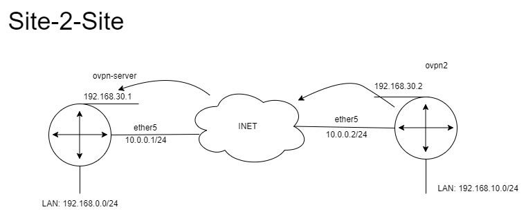

#### Server

**Create a certificate**
```
/certificate/add name=ca common-name=ca key-usage=crl-sign,key-cert-sign
/certificate/sign ca
/certificate/add name=myservercert
common-name=myservercert
/certificate/sign myservercert ca=ca
```

**Create a tunnel on ether5**
```
/ip/address/add interface=ether5 address=10.0.0.1/24
/interface/ovpn-server/add name=ovpn user=site1 disabled=no
/interface/ovpn-server/server/set enabled=yes certificate=myservercert
/ppp/secret/add local-address=192.168.30.1 name=site1 password=letmein123 remote-address=192.168.30.2
```
#### Client

**Create a tunnel on ether 5**
```
/ip/address/add interface=ether5 address=10.0.0.2/24
/interface/ovpn-client/add connect-to=10.0.0.1 password=letmein123 user=site1 disabled=no
```