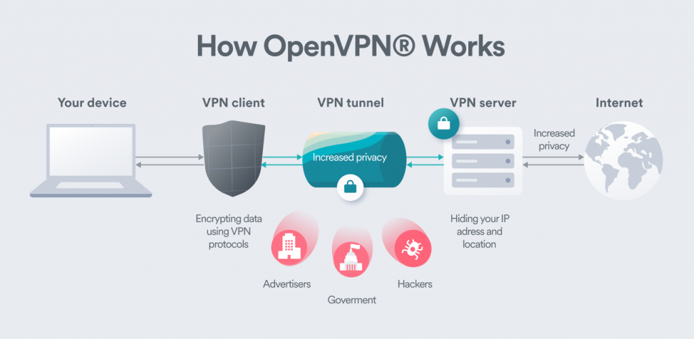

OpenVPN is eine Open-Source-Software für virtuelle private Netzwerke (VPN), die eine sichere Kommunikation über das Internet ermöglicht, indem sie eine private und verschlüsselte Verbindung zwischen zwei Punkten herstellt. Es wird weitgehend für die Einrichtung von sicheren Punkt-zu-Punkt- oder Standort-zu-Standort-Verbindungen in gerouteten oder gebrückten Konfigurationen sowie für Remote-Zugriffseinrichtungen verwendet.
### Funktionen und Aspekte von OpenVPN:
1. **Sicherheit:** OpenVPN verwendet ein benutzerdefiniertes Sicherheitsprotokoll, das OpenSSL zur Verschlüsselung nutzt. Es unterstützt verschiedene Verschlüsselungsalgorithmen und Authentifizierungsmethoden, was ein hohes Maß an Sicherheit gewährleistet.
2. **Plattformübergreifend:** OpenVPN ist mit (fast) allen Betriebssystemen kompatibel, zB.: Windows, macOS, Linux, iOS und Android.
3. **Skalierbarkeit:** OpenVPN kann für verschiedene Szenarien konfiguriert werden, von kleinen persönlichen VPNs bis hin zu unternehmensweiten Implementierungen. Es unterstützt sowohl Site-to-Site-VPNs als auch Remote-Zugriffs-VPNs.
4. **SSL/TLS für den Schlüsselaustausch:** OpenVPN verwendet SSL/TLS-Protokolle für den Schlüsselaustausch und fügt den VPN-Verbindungen eine zusätzliche Sicherheitsebene hinzu.

Insgesamt ist OpenVPN eine beliebte Wahl für Einzelpersonen, Unternehmen und Organisationen, die sichere und private Kommunikationskanäle über das Internet herstellen möchten. Es wird häufig verwendet, um VPNs für den Remote-Zugriff, sichere Kommunikation zwischen Zweigstellen oder den Zugriff auf Ressourcen über das Internet auf sichere Weise einzurichten.

