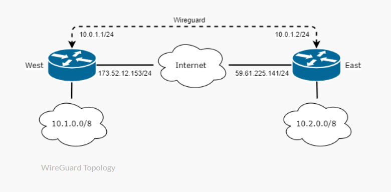

# Theorie
## Was ist WireGuard?
WireGuard ist ein modernes VPN-Protokoll, das eine sichere und verschlüsselte Verbindung zwischen verschiedenen Netzwerken ermöglicht.
## Wie funktioniert WireGuard?
WireGuard basiert auf dem Konzept von asymmetrischer Verschlüsselung und verwendet öffentliche und private Schlüssel für die Authentifizierung und Verschlüsselung des Datenverkehrs. Die Schlüsselaustausch-Protokolle ermöglichen den sicheren Austausch von Schlüsseln zwischen den Peers, um eine sichere Kommunikation zu gewährleisten.
Der Schlüsselaustausch erfolgt automatisch und sicher, ohne dass ein zentrales Managementsystem erforderlich ist.
### Schlüsselpaare
Jeder WireGuard-Peer hat ein Schlüsselpaar, bestehend aus einem privaten und einem öffentlichen Schlüssel. Der private Schlüssel bleibt geheim und wird nur auf dem jeweiligen Peer gespeichert, während der öffentliche Schlüssel an andere Peers weitergegeben wird, um sich zu authentifizieren und Daten zu verschlüsseln.
### IP-Adressen
Jeder WireGuard-Peer hat eine IP-Adresse, die ihm zugewiesen ist. Diese IP-Adressen dienen der eindeutigen Adressierung und dem Routing des Datenverkehrs zwischen den Peers innerhalb des VPN-Netzwerks.
## Wichtige Aspekte von WireGuard
### Schnelligkeit
WireGuard ist eines der schnellsten VPN-Protokolle. Dank moderner Kryptografie und einem schlanken Code läuft es äußerst performant – ideal für zeitkritische Anwendungen.
### Einfachheit
Die Konfiguration von WireGuard ist im Vergleich zu klassischen VPN-Lösungen sehr unkompliziert. Minimalistische Konfigurationsdateien erleichtern sowohl Einrichtung als auch Wartung.
### Sicherheit
Trotz seiner jungen Geschichte überzeugt WireGuard mit hoher Sicherheit: Moderne Algorithmen wie Curve25519 und ChaCha20 sorgen für starke Verschlüsselung bei geringer Angriffsfläche.

# Config


**Router West**
```
interface/wireguard/add name=West
ip/address add address=10.0.1.1/24 interface=West
interface/wireguard/peers add interface=West public-key="0tcvcpdup2e8MTJhPyzK7F/USrKjnJbzCfQKGI7VlwA=" endpoint-address=59.61.225.141 endpoint-port=13231 allowed-address=10.0.1.0/24
```

**Router East**
```
interface/wireguard/add name=East
ip/address add address=10.0.1.2/24 interface=East
interface/wireguard/peers add interface=East public-key="JXx83B44YTdZXgUyBgkoJHqGEt3ZO5Mra61C+EW1XXk=" endpoint-address=173.52.12.153 endpoint-port=13231 allowed-address=10.0.1.0/24
```

Es werden automatisch public und private Key zur Verschlüsselung der Verbindung zwischen Geräten generiert

**West-Router:**
```
[admin@ROS7West] > interface/wireguard/print
Flags: X - disabled; R - running 
 0  R name="West" mtu=1420 listen-port=13231 private-key="uEUUufex2/C36952pAj2+8Vq2/Z3Ovf+g59QoYTYbEg=" public-key="JXx83B44YTdZXgUyBgkoJHqGEt3ZO5Mra61C+EW1XXk="
```

**East-Router:**
```
 [admin@ROS7East] > interface/wireguard/print
Flags: X - disabled; R - running 
 0  R name="East" mtu=1420 listen-port=13231 private-key="SP5dLklX/7dRrfEmequW+bJVisAx4ajMF/VzdYHv30U=" public-key="0tcvcpdup2e8MTJhPyzK7F/USrKjnJbzCfQKGI7VlwA="
```

Beide Router erkennen sich gegenseitig über ihre öffentlichen Schlüssel und tauschen Daten sicher über das WireGuard-Protokoll aus. Die Verbindung ist verschlüsselt, performant und ohne manuelle Schlüsselverteilung einsatzbereit.