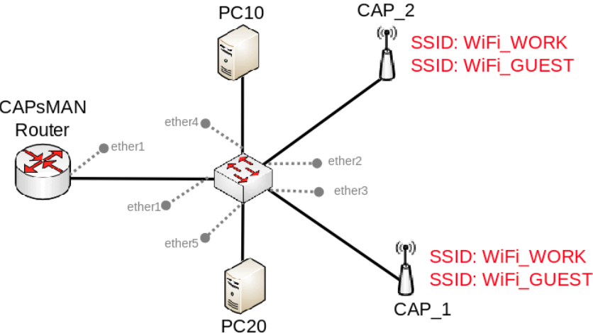

# Theorie

- Steuergeret ist etweder eine Hardware oder eine VM
- Vorteil bei Microtik: CAPsMAN kann auf jedem Gerät laufen
- Zwei Arten:
  - Trafic wird beim Access point ins LAN entlassen (Local breakout)
  - Gesammten trafic bis zu Controller führen und dort entlassen (Centralized Breakout)

# Config
```
/interface bridge
add name=br vlan-filtering=yes

/interface vlan
add interface=br name=MAIN vlan-id=10
add interface=br name=GUEST vlan-id=20

/interface wifi datapath
add bridge=br name=MAIN vlan-id=10
add bridge=br name=GUEST vlan-id=20

/interface wifi security
add authentication-types=wpa2-psk,wpa3-psk ft=yes ft-over-ds=yes name=Security_MAIN passphrase=HaveAg00dDay
add authentication-types=wpa2-psk,wpa3-psk ft=yes ft-over-ds=yes name=Security_GUEST passphrase=HaveAg00dDay

/interface wifi configuration
add datapath=MAIN name=MAIN security=Security_MAIN ssid=MAIN_Network
add datapath=GUEST name=GUEST security=Security_GUEST ssid=GUEST_Network

/ip pool
add name=dhcp_pool0 ranges=192.168.1.2-192.168.1.254
add name=dhcp_pool1 ranges=192.168.10.2-192.168.10.254
add name=dhcp_pool2 ranges=192.168.20.2-192.168.20.254

/ip dhcp-server
add address-pool=dhcp_pool0 disabled=yes interface=br name=dhcp1
add address-pool=dhcp_pool1 interface=MAIN name=dhcp2
add address-pool=dhcp_pool2 interface=GUEST name=dhcp3

/interface bridge port
add bridge=br interface=ether5 
add bridge=br interface=ether4 
add bridge=br interface=ether3 
add bridge=br interface=ether2 

/interface bridge vlan
add bridge=br tagged=br,ether5,ether4,ether3,ether2 vlan-ids=20
add bridge=br tagged=br,ether5,ether4,ether3,ether2 vlan-ids=10

/interface wifi capsman
set enabled=yes interfaces=br

/interface wifi provisioning
add action=create-dynamic-enabled master-configuration=MAIN slave-configurations=GUEST supported-bands=5ghz-ax
add action=create-dynamic-enabled master-configuration=MAIN slave-configurations=GUEST supported-bands=2ghz-ax

/ip address
add address=192.168.1.1/24 interface=br network=192.168.1.0
add address=192.168.10.1/24 interface=MAIN network=192.168.10.0
add address=192.168.20.1/24 interface=GUEST network=192.168.20.0

/ip dhcp-server network
add address=192.168.1.0/24 gateway=192.168.1.1
add address=192.168.10.0/24 gateway=192.168.10.1
add address=192.168.20.0/24 gateway=192.168.20.1

/system identity
set name=cAP_Controller
```