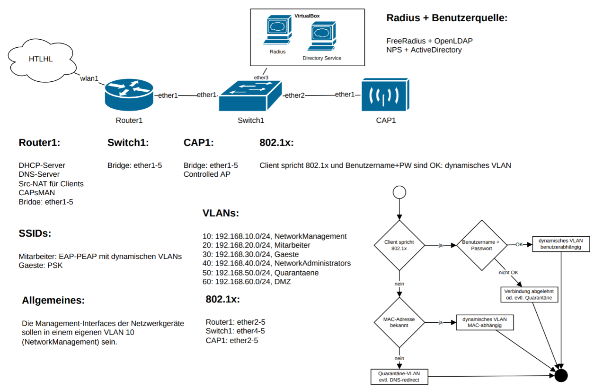

# Theorie
CAPsMAN ermöglicht es einem MikroTik-Router, als zentraler Controller für mehrere Wireless APs zu fungieren. Diese Funktion ist besonders nützlich in Netzwerken mit mehreren APs, da sie eine zentrale Konfiguration, Verwaltung und Überwachung ermöglicht. CAPsMAN übernimmt Aufgaben wie die Verwaltung der Frequenznutzung, Client-Roaming, Lastverteilung und die Konfiguration von Sicherheitseinstellungen.

- Steuergeret ist etweder eine Hardware oder eine VM
- Vorteil bei Microtik: CAPsMAN kann auf jedem Gerät laufen
- Zwei Arten:
  - Trafic wird beim Access point ins LAN entlassen (Local breakout)
  - Gesammten trafic bis zu Controller führen und dort entlassen (Centralized Breakout)

# Config



## CAP1
```
/system/identity/set name=CAP1

/interface/bridge/add name=br

/interface/vlan/add interface=br name=VLAN10 vlan-id=10

/interface/wifi/datapath/add bridge=br name=capdp

/interface/wifi/set [ find default-name=wifi1 ] configuration.manager=capsman .mode=ap datapath=capdp disabled=no
/interface/wifi/set [ find default-name=wifi2 ] configuration.manager=capsman .mode=ap datapath=capdp disabled=no

/interface/bridge/port/add bridge=br interface=ether1
/interface/bridge/port/add bridge=br interface=ether2
/interface/bridge/port/add bridge=br interface=ether3

/interface/bridge/vlan/add bridge=br tagged=br,ether1 vlan-ids=10

/interface/bridge/vlan/add bridge=br tagged=ether1 vlan-ids=20
/interface/bridge/vlan/add bridge=br tagged=ether1 vlan-ids=30
/interface/bridge/vlan/add bridge=br tagged=ether1 vlan-ids=40
/interface/bridge/vlan/add bridge=br tagged=ether1 vlan-ids=50
/interface/bridge/vlan/add bridge=br tagged=ether1 vlan-ids=60

/interface/wifi/cap/set discovery-interfaces=VLAN10 enabled=yes slaves-datapath=capdp
/ip/dhcp-client/add interface=VLAN10

/interface/bridge/set [ find name=br ] vlan-filtering=yes
```

## Router 1
```
/system identity
set name=Router1

/interface bridge
add name=br vlan-filtering=yes

/interface vlan
add interface=br name=VLAN10 vlan-id=10
add interface=br name=VLAN20 vlan-id=20
add interface=br name=VLAN30 vlan-id=30
add interface=br name=VLAN40 vlan-id=40
add interface=br name=VLAN50 vlan-id=50
add interface=br name=VLAN60 vlan-id=60

/interface wifi channel
add band=5ghz-ax name=5ghz80mhz skip-dfs-channels=all width=20/40/80mhz
add band=2ghz-ax name=2ghz20mhz skip-dfs-channels=all width=20mhz

/interface wifi datapath
add name=DPGaeste vlan-id=30
add name=DPMitarbeiter vlan-id=20

/interface wifi security
add authentication-types=wpa2-psk disabled=no name=SecHTLIoT passphrase=hollabrunn
add authentication-types=wpa2-psk name=SecGaeste passphrase=GaesteGaeste
add authentication-types=wpa2-psk name=SecMitarbeiter passphrase=Mitarbeiter
#add authentication-types=wpa2-eap name=SecMitarbeiter

/interface wifi
set [ find default-name=wifi1 ] configuration.country=Austria .manager=local .mode=station-bridge .ssid=\
    HTLIoT disabled=no security=SecHTLIoT
/interface wifi configuration
add channel=5ghz80mhz country=Austria datapath=DPGaeste mode=ap name=Gaeste5ghz security=SecGaeste ssid=\
    Gaeste tx-power=1
add channel=2ghz20mhz country=Austria datapath=DPGaeste mode=ap name=Gaeste2ghz security=SecGaeste ssid=\
    Gaeste tx-power=1
add datapath=DPMitarbeiter mode=ap name=Mitarbeiter security=SecMitarbeiter ssid=Mitarbeiter

/ip pool
add name=POOL10 ranges=192.168.10.10-192.168.10.100
add name=POOL20 ranges=192.168.20.10-192.168.20.100
add name=POOL30 ranges=192.168.30.10-192.168.30.100
add name=POOL40 ranges=192.168.40.10-192.168.40.100
add name=POOL50 ranges=192.168.50.10-192.168.50.100
add name=POOL60 ranges=192.168.60.10-192.168.60.100

/interface bridge port
add bridge=br interface=ether1
add bridge=br interface=ether2 pvid=10
add bridge=br interface=ether3

/interface bridge vlan
add bridge=br tagged=br,ether1 untagged=ether2 vlan-ids=10
add bridge=br tagged=br,ether1 vlan-ids=20
add bridge=br tagged=br,ether1 vlan-ids=30
add bridge=br tagged=br,ether1 vlan-ids=40
add bridge=br tagged=br,ether1 vlan-ids=50
add bridge=br tagged=br,ether1 vlan-ids=60

/interface wifi capsman
set enabled=yes interfaces=VLAN10

/interface wifi provisioning
add action=create-enabled master-configuration=Gaeste5ghz name-format=%I-5ghz slave-configurations=\
    Mitarbeiter supported-bands=5ghz-ax
add action=create-enabled master-configuration=Gaeste2ghz name-format=%I-2ghz slave-configurations=\
    Mitarbeiter supported-bands=2ghz-ax

/ip address
add address=192.168.10.1/24 interface=VLAN10 network=192.168.10.0
add address=192.168.20.1/24 interface=VLAN20 network=192.168.20.0
add address=192.168.30.1/24 interface=VLAN30 network=192.168.30.0
add address=192.168.40.1/24 interface=VLAN40 network=192.168.40.0
add address=192.168.50.1/24 interface=VLAN50 network=192.168.50.0
add address=192.168.60.1/24 interface=VLAN60 network=192.168.60.0

/ip dhcp-client
add interface=wifi1

/ip dhcp-server
add address-pool=POOL10 interface=VLAN10 name=DHCP10
add address-pool=POOL20 interface=VLAN20 name=DHCP20
add address-pool=POOL30 interface=VLAN30 name=DHCP30
add address-pool=POOL40 interface=VLAN40 name=DHCP40
add address-pool=POOL50 interface=VLAN50 name=DHCP50
add address-pool=POOL60 interface=VLAN60 name=DHCP60

/ip dhcp-server network
add address=192.168.10.0/24 dns-server=192.168.60.1 gateway=192.168.10.1
add address=192.168.20.0/24 dns-server=192.168.60.1 gateway=192.168.20.1
add address=192.168.30.0/24 dns-server=192.168.60.1 gateway=192.168.30.1
add address=192.168.40.0/24 dns-server=192.168.60.1 gateway=192.168.40.1
add address=192.168.50.0/24 dns-server=192.168.60.1 gateway=192.168.50.1
add address=192.168.60.0/24 dns-server=192.168.60.1 gateway=192.168.60.1

/ip dns
set allow-remote-requests=yes

/ip firewall nat
add action=masquerade chain=srcnat out-interface=wifi1#

