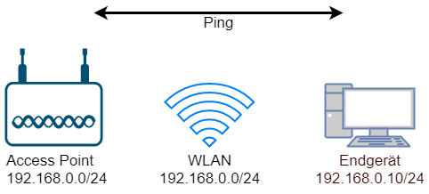
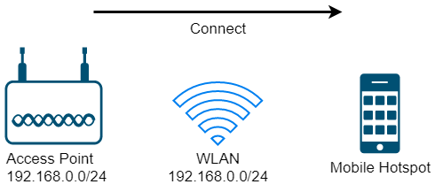

# Theorie
## Übersicht
Der Begriff **Wireless** bezieht sich auf Wireless Local Area Network bzw. Wireless LAN oder auch **WLAN**, im Englischen oft **Wi-Fi** genannt.  
Dabei werden Informationen über Funk übertragen, statt über ein gewöhnliches Netzwerkkabel.
## Beschreibung
Als Medium für WLAN dient die Luft bzw. alles, was sich zwischen zwei Endgeräten befindet.  
Im Mittelpunkt steht ein sogenannter **Access Point**, der das WLAN „ausstrahlt“. Jede Kommunikation im WLAN funktioniert über diesen „AP“.

Um verschiedene Netzwerke zu unterscheiden, wird eine **SSID** (Service Set Identifier, also ein Name) verwendet. Mehrere Access Points können dieselbe SSID haben.

Innerhalb eines WLANs bekommt jedes Endgerät alle Daten mit. Deshalb verwendet man eine Form von **Authentifizierung**, um sich verbinden zu dürfen.  
Zusätzlich kann auch eine **Access List** verwendet werden, um den Zugriff auf den Access Point einzuschränken.
## Standards
Das IEEE 802.11-Standardwerk beschreibt verschiedene Versionen von WLAN (Wireless Local Area Network), die sich hinsichtlich Geschwindigkeit, Frequenzbereich und Technologien unterscheiden.

| Standard | Frequenzbereich | Max. Datenrate | Besonderheiten                                                                              |
| -------- | --------------- | -------------- | ------------------------------------------------------------------------------------------- |
| 802.11g  | 2.4 GHz         | 54 Mbit/s      | Rückwärtskompatibel zu 802.11b, aber störanfällig durch andere Geräte im 2,4-GHz-Band       |
| 802.11n  | 2.4 & 5 GHz     | 600 Mbit/s     | Einführung von MiMo (Multiple Input Multiple Output) zur Verbesserung der Datenrate         |
| 802.11ac | 5 GHz           | 6.93 Gbit/s    | Unterstützt breitere Kanäle (80 MHz, 160 MHz) und Mehrfachantennentechnologien              |
| 802.11ax | 2.4 & 5 GHz     | 9.6 Gbit/s     | OFDMA (Orthogonal Frequency-Division Multiple Access), bessere Effizienz, niedrigere Latenz |
### Frequenzbänder
#### 2,4 GHz
Sehr eingeschränkt. Es gibt zwar 14 Kanäle, diese überlappen sich jedoch, was die real nutzbaren Kanäle auf maximal 4 gleichzeitig begrenzt.  
Vor allem in dicht besiedelten Gebieten kommt es hier häufig zu Problemen mit instabilen oder langsamen Verbindungen, da sich die Geräte gegenseitig stören.
#### 5 GHz
Daher wurde ab Wi-Fi 5 auch ein Bereich im 5-GHz-Band verwendet. Hier gibt es 18 voll nutzbare 20-MHz-Kanäle, welche das Problem der schlechten Verbindungen in Wohnblöcken stark vermindern.  
Es gibt jedoch auch „Nachteile“, da 5-GHz-Wellen keine so große Reichweite wie 2,4-GHz-Wellen haben. In vielen Ländern gibt es zudem gesetzliche Einschränkungen bei der Nutzung bestimmter Kanäle, da manche Frequenzen beispielsweise Wetterradar oder Flughafentechnik stören könnten.
#### 6 GHz
Ab Wi-Fi 6E wird auch das 6-GHz-Band genutzt. Hier gibt es 59 20-MHz-Kanäle oder 7 160-MHz-Kanäle. In der EU jedoch „nur“ 3 nutzbare 160-MHz-Kanäle.  
Die Reichweite ist allerdings noch geringer als bei 5 GHz.
### Bandbreiten
- 20 MHz (Standard für 2,4 GHz)
- 40 MHz (802.11n)
- 80 MHz (802.11ac)
- 160 MHz (802.11ac/ax für maximale Datenraten)
## MiMo (Multiple Input Multiple Output)
MIMO steht für **Multiple Input Multiple Output** und wird bereits seit Wi-Fi 4 verwendet.  
Durch Kanalbündelung werden quasi zwei oder mehr Verbindungen gleichzeitig aufgebaut, wodurch die Übertragungsrate drastisch erhöht werden kann.  
Dazu gibt es bereits in der Definition der Bänder genormte Kanäle, die zusammengefasst werden können.

- **SU-MiMo (Single User MiMo):** Ein Client profitiert von mehreren Antennen
- **MU-MiMo (Multi User MiMo):** Mehrere Clients können gleichzeitig Daten senden und empfangen
## QAM (Quadrature Amplitude Modulation)
Zur Steigerung der Übertragungsdichte bei kabelloser Kommunikation wird im Standard 802.11 **QAM** (Quadrature Amplitude Modulation) eingesetzt.  
Durch Phasenverschiebung wird ein zweidimensionales Gitter aufgespannt, und durch Änderung der Amplitude wird ein bestimmter Wert festgelegt.  

Bei 4-QAM gibt es 2 Eingangssignale, die durch Multiplikation mit cos(2πft) und sin(2πft) phasenverschoben werden. Diese Signale werden dann addiert und versendet.  
Auf der Empfängerseite wird das Signal wieder mit cos(2πft) und sin(2πft) multipliziert. So erhält man klar unterscheidbare Signale, die durch einen Tiefpassfilter „verschönert“ werden können.

Durch QAM können – je nach Dichte des QAM-Gitters – pro Zeiteinheit mehr als nur ein Bit übertragen werden:

| Modulation | Bits pro Symbol |
| ---------- | --------------- |
| AM         | 1 Bit           |
| 4-QAM      | 2 Bit           |
| 16-QAM     | 4 Bit           |
| 256-QAM    | 8 Bit           |
## Kanalbündelung (Channel Bonding)
Durch das Bündeln von zwei oder mehr Kanälen kann die verfügbare Bandbreite erhöht werden, was höhere Datenraten ermöglicht. Dies wird vor allem im 5-GHz-Band genutzt (40 MHz, 80 MHz, 160 MHz).

# Config
## Offenes WLAN


```RouterOS
/interface/wifi/security
add name=sec_open authentication-types="" encryption=""
 
/interface/wifi
set [find name=wlan2] country=austria disabled=no installation=indoor mode=ap-bridge security=sec_open ssid="Simple Open WLAN"
 
/ip/address
add address=192.168.0.1/24 interface=wlan2
```

**Ping:**
```RouterOS
> ping address=192.168.0.10
  SEQ HOST                                     SIZE TTL TIME       STATUS                                                                                                                        
    0 192.168.0.10                               56  64 36ms425us 
    1 192.168.0.10                               56  64 2ms618us  
    2 192.168.0.10                               56  64 3ms627us  
    sent=3 received=3 packet-loss=0% min-rtt=2ms618us avg-rtt=14ms223us max-rtt=36ms425us
```
## Passwort-geschütztes WLAN

Gleich wie oben, aber es wird ein Passwort benötigt, um sich mit dem WLAN zu verbinden.  
**Security-Profile erzeugen:**
```RouterOS
/interface/wifi/security
add name=sec_wpa2-psk authentication-types=wpa2-psk encryption=aes-ccm passphrase="Ww1ssPfuAP"
```

**Im WLAN verwenden:**
```RouterOS
/interface/wifi
set [find name=wlan2] security=sec_wpa2-psk
```
## WLAN-Client
Ein Access Point kann sich auch mit einem bestehenden WLAN verbinden:

  

```RouterOS
/interface/wifi/security
add name=sec_client authentication-types=wpa2-psk encryption=aes-ccm passphrase="12345678"

/interface/wifi
set [find name=wlan1] mode=station ssid="mar.io" security=sec_client country=austria installation=indoor disabled=no frequency-mode=superchannel bands=2ghz-b/g/n
```
## Hilfe für MikroTik

Mit folgendem Befehl wird Logging im Zusammenhang mit WLAN aktiviert:
```RouterOS
/system/logging/add topics=wireless
```

Dann Log anzeigen:
```RouterOS
/log/print
```
 

## Von der MikroTik Website

```
# Access Point Erstellen
 
/interface wifi security
add name=sec1 authentication-types=wpa3-psk passphrase=HaveAg00dDay

#create configuraiton profiles to use for provisioning
/interface wifi configuration
add country=Latvia name=5ghz security=sec1 ssid=CAPsMAN_5
add name=2ghz security=sec1 ssid=CAPsMAN2
add country=Latvia name=5ghz_v security=sec1 ssid=CAPsMAN5_v

#configure provisioning rules, configure band matching as needed
/interface wifi provisioning
add action=create-dynamic-enabled master-configuration=5ghz slave-configurations=5ghz_v supported-bands=\
    5ghz-n
add action=create-dynamic-enabled master-configuration=2ghz supported-bands=2ghz-n

#enable CAPsMAN service
/interface wifi capsman
set ca-certificate=auto enabled=yes
```